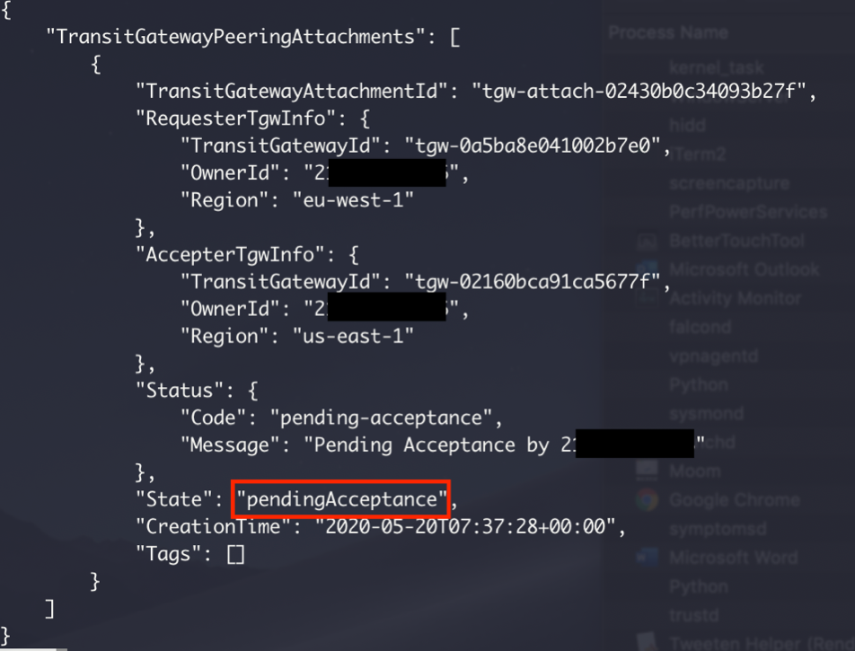
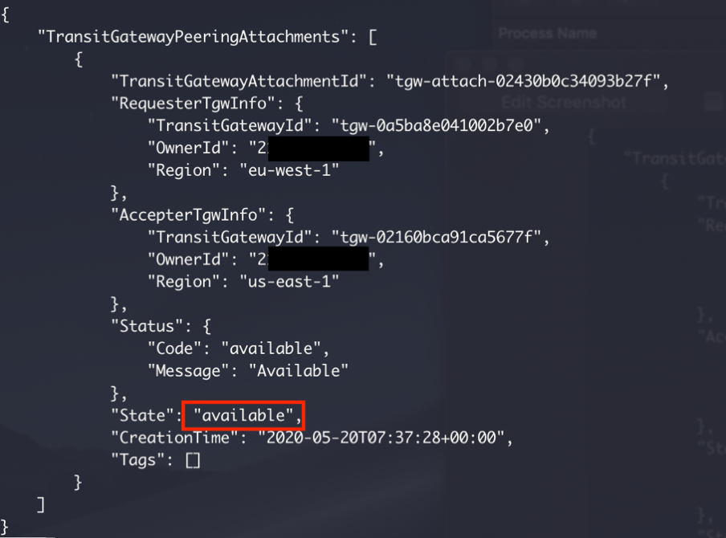
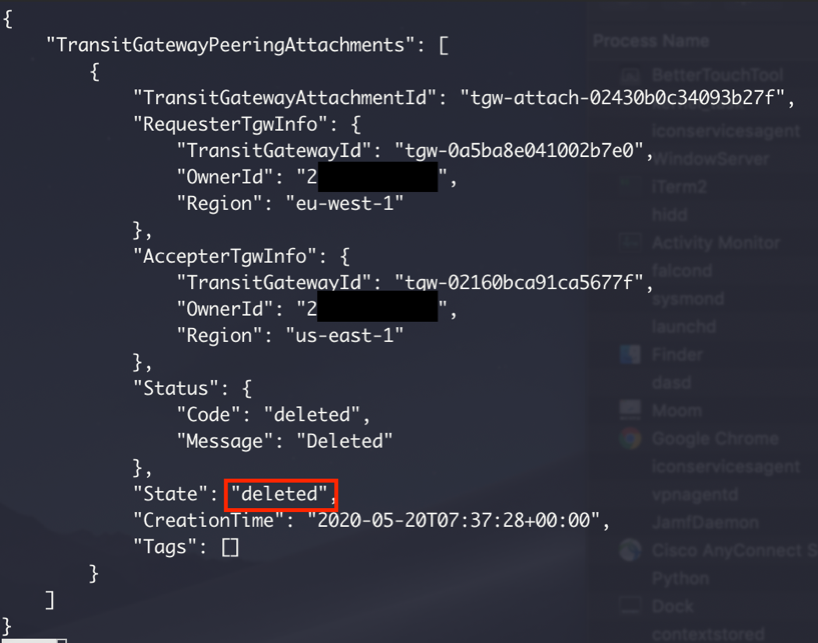

# Using the AWS CDK and AWS Transit Gateway inter-Region peering to build a global network.

> This CDK project goes through the creation of a global network that spans multiple AWS Regions using AWS Transit Gateway inter-Region peering.

## Solution Overview

The following diagram is referred to throughout this project.


While the transit gateway only connects to VPCs within the same Region, you can establish peering connections between AWS Transit Gateways in different AWS Regions. This lets you build global, cloud-based networks. Traffic using transit gateway peering stays on the AWS global network and never traverses the public internet and is encrypted in flight – so it always takes the most optimal path, in the most secure way.

By following these steps, you will also launch one EC2 instance in each of the regions as well as VPC endpoints to access the instances using AWS Systems Manager Session Manager. This allows you to verify two-way connectivity by pinging from one instance to the other.

## Deployment Steps

Pre-requisites:

-	An [AWS account](https://aws.amazon.com/) without any existing transit gateways in us-east-1 or eu-west-1
-	[AWS CLI, authenticated and configured](https://docs.aws.amazon.com/cli/latest/userguide/cli-configure-files.html)
-	[Python 3.6+](https://www.python.org/downloads/)
-	[AWS CDK](https://docs.aws.amazon.com/cdk/latest/guide/getting_started.html#getting_started_install)
-	[Git](http://git-scm.com/downloads)

Step 1: Using your device’s command line, check out our Git repository to a local directory on your device:

`git clone https://github.com/aws-samples/aws-cdk-transit-gateway-peering`

Step 2: Change directories to the new directory that was created during the previous step:

`cd aws-cdk-transit-gateway-peering/`

Step 2a: Copy the following JSON document to tell the AWS CDK which command to use to run your app. (This is for Windows only):

Windows: `copy cdk-windows.json cdk.json /Y`

Step 3: Create a virtual environment:

MacOS/Linux: `python3 -m venv .env`<br />
Windows: `python -m venv .env`

Step 4: Activate the virtual environment after the init process completes and the virtual environment is created:

MacOS/Linux: `source .env/bin/activate`<br />
Windows: `.env\Scripts\activate.bat`

Step 5: Install the required dependencies:

`pip3 install -r requirements.txt`

Step 6: Synthesize the templates. AWS CDK apps use code to define the infrastructure, and when run, they produce, or “synthesize” an AWS CloudFormation template for each stack defined in the application:

`cdk synthesize`

Step 7: Deploy the solution. By default, some actions that could potentially make security changes, require approval. In this deployment, you are creating an IAM role for the EC2 instances and creating security groups. The following command overrides the approval prompts but if you would like to manually accept the prompts, omit the “--require-approval never” flag:

`cdk deploy "*" --require-approval never`

While the AWS CDK deploys the CloudFormation stacks, you can follow the deployment progress in your terminal:


The code in the GitHub project deploys resources in us-east-1 and eu-west-1, including VPCs, transit gateways, and EC2 instances.

The deployment is divided into four stacks, two per Region. Within each Region, the first stack deploys the network and the second deploys the EC2 instances. There is an explicit dependency between the stacks to ensure that the underlying network infrastructure exists before you create the EC2 instances. 

The relevant code in the `app.py` file is shown below:

```
network_stack_us_east_1 = Network(app, "network-stack-us-east-1",
        cidr_range="172.16.0.0/24",
        tgw_asn=64512,
        env={
            'region': 'us-east-1',
        }
    )

network_stack_eu_west_1 = Network(app, "network-stack-eu-west-1",
        cidr_range="172.16.1.0/24",
        tgw_asn=64513,
        env={
            'region': 'eu-west-1',
        }
    )

ec2_stack_us_east_1 = Ec2(app, id="instance-stack-us-east-1",
        network_stack=network_stack_us_east_1, 
        env={
            'region': 'us-east-1',
        }
    )

ec2_stack_eu_west_1 = Ec2(app, id="instance-stack-eu-west-1",
        network_stack=network_stack_eu_west_1, 
        env={
            'region': 'eu-west-1',
        }
    )
ec2_stack_us_east_1.add_dependency(network_stack_us_east_1)
ec2_stack_eu_west_1.add_dependency(network_stack_eu_west_1)
```

Step 8: Once the stacks have successfully deployed, execute the series of Python scripts that you checked out from the Git repository during step 1. Python scripts are required as transit gateway peering is not yet natively supported by AWS CloudFormation. Establish the transit gateway peering connection:

MacOS/Linux: `python3 create-tgw-peering.py`<br />
Windows: `python create-tgw-peering.py`

Initially, the peering connection’s state change shows as “initiatingRequest” – but it should only remain that way for less than a minute. Run the following verification command and validate, in the output, that the peering connection’s state is showing as “pendingAcceptance” before proceeding to step 9:

`aws ec2 describe-transit-gateway-peering-attachments --region us-east-1`



Step 9: Accept the peering request:

MacOS/Linux: `python3 accept-tgw-peering.py`<br />
Windows: `python accept-tgw-peering.py`

Shortly after accepting the peering request, the peering connection’s state will show as “pending” and it will remain in that state for a few minutes. Run the following verification command and ensure that, in the output, the peering connection’s state is showing as “available” before moving on to step 10:

`aws ec2 describe-transit-gateway-peering-attachments --region us-east-1`



Step 10: Once the peering connection has changed to “available”, add a route to each AWS Transit Gateway’s route table:

MacOS/Linux: `python3 create-tgw-routes.py`<br />
Windows: `python create-tgw-routes.py`

## Verification Steps

To verify cross-region network connectivity, log into the AWS Management Console, select the us-east-1 Region and navigate to the EC2 service. Select “running instances” and then select the EC2 instance that was created during step 7 of the deployment procedure when the AWS CDK deployed the stacks. Scroll down and take note of the private IP address. Also, take note of the private IP address for the EC2 instance in the eu-west-1 Region. 

Select the EC2 instance in one Region and choose **Connect**. For the connection method, select **Session Manager** and click on **Connect**:


Ping the private IP address of the EC2 instance in the opposite Region in order to confirm end-to-end network connectivity:

`ping [private IP address of EC2 instance in opposite Region]`

If the ping packets are transmitted and received as in the next screenshot, congratulations! You’ve properly enabled transit gateway peering and validated end to end IP connectivity.


If you are not receiving pings, go through the previous steps to ensure that you haven’t missed anything or made any misconfigurations.

## Cleanup

Follow these steps to remove the resources that were deployed in this post.

Step 1: Delete the two transit gateway routes that were created to send traffic across the peering connection and also delete the peering connection itself:

MacOS/Linux: `python3 cleanup.py`<br />
Windows: `python cleanup.py`

It takes a few minutes for the peering connection to be deleted. Run the following command and ensure that, in the output, the peering connection’s state is showing as “deleted” before moving on to step 2:

`aws ec2 describe-transit-gateway-peering-attachments --region us-east-1`



Step 2:  Terminate the rest of the resources with the following command: 

`cdk destroy "*"`

When asked to confirm the deletion of the four stacks, select “`y`”.

## License

This library is licensed under the MIT-0 License. See the LICENSE file.